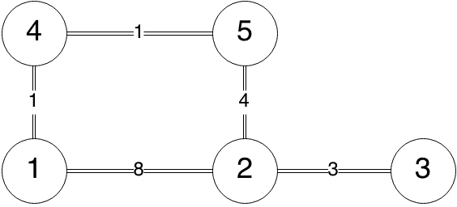

Routing Algorithms
================

These are Linkstate(Dijkstra) and Distance Vector(Bellman-Ford) implementation in C++.  
How to get:
-------------

    git clone https://github.com/rhuangab/routingAlgorithm.git
    Make
  
How to run:
----------
Run by using std io:

    ./routingAlgor -stdio
    
Run by using file io:

    ./routingAlgor <topofile> <messagefile> <changesfile>
    
The output of these two algorithms are available in (by default setting): 
      
    linkstate_output.txt
    distvec_output.txt
    
File format:
-----------
There are 3 sample file provided: `topology.txt` `messages.txt` `changes.txt`  
######topology.txt
Each line representing an edge: <node 1> <node 2> <distance>
```
1 2 8
2 3 3
2 5 4
4 1 1
4 5 1
```

######messages.txt
Each line represneting a message: <from> <to> <message content>
```
2 1 here is a message from 2 to 1
3 5 this one gets sent from 3 to 5!
```
######changes.txt
Each line representing a change to an edge: <node 1> <node 2> <distance>  
```
2 4 1
2 4 -999
```
Note that negative distance means the edge is broken, because in undirected graph, a negative cost edge mean negative cycle.  

    
    
